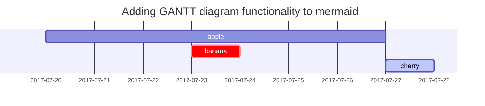

## 标题示例

<!-- markdownlint-capture -->
<!-- markdownlint-disable -->
# H1 — heading
{: .mt-4 .mb-0 }

## H2 — heading
{: data-toc-skip='' .mt-4 .mb-0 }

### H3 — heading
{: data-toc-skip='' .mt-4 .mb-0 }

#### H4 — heading
{: data-toc-skip='' .mt-4 }
<!-- markdownlint-restore -->

## 段落

Quisque egestas convallis ipsum, ut sollicitudin risus tincidunt a. Maecenas interdum malesuada egestas. Duis consectetur porta risus, sit amet vulputate urna facilisis ac. Phasellus semper dui non purus ultrices sodales. Aliquam ante lorem, ornare a feugiat ac, finibus nec mauris. Vivamus ut tristique nisi. Sed vel leo vulputate, efficitur risus non, posuere mi. Nullam tincidunt bibendum rutrum. Proin commodo ornare sapien. Vivamus interdum diam sed sapien blandit, sit amet aliquam risus mattis. Nullam arcu turpis, mollis quis laoreet at, placerat id nibh. Suspendisse venenatis eros eros.

> 这一段保留原始拉丁文伪文本，用于展示字体和段落的排版效果。

## 列表

### 有序列表

1. Firstly
2. Secondly
3. Thirdly

### 无序列表

- Chapter
  - Section
    - Paragraph

### 待办列表

- [ ] Job
  - [x] Step 1
  - [x] Step 2
  - [ ] Step 3

### 说明列表

Sun
: the star around which the earth orbits

Moon
: the natural satellite of the earth, visible by reflected light from the sun

## 引用

> 这一行展示了 _块级引用_ 的样式。

## 提示块

<!-- markdownlint-capture -->
<!-- markdownlint-disable -->
> 这是 `tip` 类型提示的示例。
{: .prompt-tip }

> 这是 `info` 类型提示的示例。
{: .prompt-info }

> 这是 `warning` 类型提示的示例。
{: .prompt-warning }

> 这是 `danger` 类型提示的示例。
{: .prompt-danger }
<!-- markdownlint-restore -->

## 表格

| Company                      | Contact          | Country |
| :--------------------------- | :--------------- | ------: |
| Alfreds Futterkiste          | Maria Anders     | Germany |
| Island Trading               | Helen Bennett    |      UK |
| Magazzini Alimentari Riuniti | Giovanni Rovelli |   Italy |

## 链接

<http://127.0.0.1:4000>

## 脚注

点击脚注钩子即可跳转到脚注[^footnote]，这里还有另外一个脚注[^fn-nth-2]。

## 行内代码

下面演示 `Inline Code` 的显示效果。

## 文件路径

示例：`/path/to/the/file.extend`{: .filepath}。

## 代码块

### 普通代码块

```text
This is a common code snippet, without syntax highlight and line number.
```

### 指定语言

```bash
if [ $? -ne 0 ]; then
  echo "The command was not successful.";
  #do the needful / exit
fi;
```

### 指定文件名

```sass
@import
  "colors/light-typography",
  "colors/dark-typography";
```
{: file='_sass/jekyll-theme-chirpy.scss'}

## 数学公式

下方由 [**MathJax**](https://www.mathjax.org/) 渲染：

$$
\begin{equation}
  \sum_{n=1}^\infty 1/n^2 = \frac{\pi^2}{6}
  \label{eq:series}
\end{equation}
$$

可通过 \eqref{eq:series} 引用该公式。

当 $a \ne 0$ 时，二次方程 $ax^2 + bx + c = 0$ 的解为：

$$ x = {-b \pm \sqrt{b^2-4ac} \over 2a} $$

## Mermaid 图



## 图片

### 默认（带说明文字）

{: width="972" height="589" }
_占满屏幕宽度并居中对齐_

### 左对齐

{: width="972" height="589" .w-75 .normal}

### 浮动在左侧

{: width="972" height="589" .w-50 .left}
Praesent maximus aliquam sapien. Sed vel neque in dolor pulvinar auctor. Maecenas pharetra, sem sit amet interdum posuere, tellus lacus eleifend magna, ac lobortis felis ipsum id sapien. Proin ornare rutrum metus, ac convallis diam volutpat sit amet. Phasellus volutpat, elit sit amet tincidunt mollis, felis mi scelerisque mauris, ut facilisis leo magna accumsan sapien. In rutrum vehicula nisl eget tempor. Nullam maximus ullamcorper libero non maximus. Integer ultricies velit id convallis varius. Praesent eu nisl eu urna finibus ultrices id nec ex. Mauris ac mattis quam. Fusce aliquam est nec sapien bibendum, vitae malesuada ligula condimentum.

### 浮动在右侧

{: width="972" height="589" .w-50 .right}
Praesent maximus aliquam sapien. Sed vel neque in dolor pulvinar auctor. Maecenas pharetra, sem sit amet interdum posuere, tellus lacus eleifend magna, ac lobortis felis ipsum id sapien. Proin ornare rutrum metus, ac convallis diam volutpat sit amet. Phasellus volutpat, elit sit amet tincidunt mollis, felis mi scelerisque mauris, ut facilisis leo magna accumsan sapien. In rutrum vehicula nisl eget tempor. Nullam maximus ullamcorper libero non maximus. Integer ultricies velit id convallis varius. Praesent eu nisl eu urna finibus ultrices id nec ex. Mauris ac mattis quam. Fusce aliquam est nec sapien bibendum, vitae malesuada ligula condimentum.

### 深浅色模式与阴影

下方图片会根据主题偏好自动切换深浅色，同时带有阴影。

{: .light .w-75 .shadow .rounded-10 w='1212' h='668' }
{: .dark .w-75 .shadow .rounded-10 w='1212' h='668' }

## 视频

<iframe
  src="https://player.bilibili.com/player.html?bvid=BV1xK4y1b7Xa&autoplay=0"
  scrolling="no"
  border="0"
  frameborder="no"
  framespacing="0"
  allowfullscreen
  style="width: 100%; height: 480px;"
></iframe>

## 反向脚注

[^footnote]: The footnote source
[^fn-nth-2]: The 2nd footnote source
