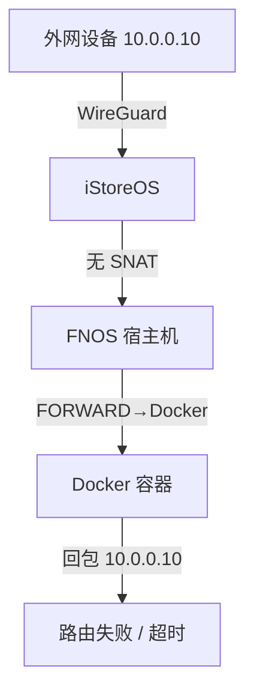
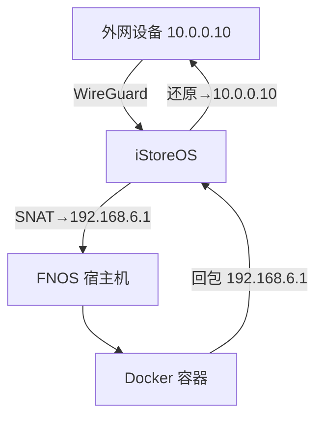

# WireGuard 外网无法访问 FNOS Docker 服务 - 排查记录

## TL;DR

- **现象**：WireGuard 远端只能打开 FNOS 自身服务，映射到 Docker 的端口全部超时。
- **根因**：FNOS 的 `FORWARD` 链默认 DROP，且 iStoreOS 没有对 VPN 网段做 SNAT，导致请求进容器但回包无路可走。
- **修复**：在 FNOS `DOCKER-USER` 链放行 `192.168.6.0/24`，在 iStoreOS 对 `10.0.0.0/24` 做 `MASQUERADE`，并持久化规则。
- **快速入口**：[直接查看最终修复命令](#最终修复命令)

## 环境信息

| 设备 | 说明 |
|---|---|
| **路由器** | iStoreOS（WireGuard 服务端） |
| **NAS** | FNOS（IP：`192.168.6.111`，运行 Docker 服务） |
| **VPN 网段** | `10.0.0.0/24` |
| **内网网段** | `192.168.6.0/24` |

---

## 问题描述

外网通过 WireGuard VPN 连接后：

- ✅ 可以访问 FNOS 页面（非 Docker 服务）
- ❌ 无法访问 FNOS 上的 Docker 服务（如 `:3000`、`:3001` 等端口）
- 错误表现：**响应时间过长（超时）**，而非连接被拒绝

---

## 排查过程

### 第一步：确认 VPN 网段

在 iStoreOS 上执行：

```bash
wg show | sed -n '1,8p'
```

```
interface: WireGuard
    listening port: 52525
peer: ...
    allowed ips: 10.0.0.10/32
```

确认 VPN 网段为 `10.0.0.0/24`。

---

### 第二步：分析为何 FNOS 页面能访问，Docker 不能

| 访问目标 | 流量路径 | 经过的链 | 结果 |
|---|---|---|---|
| FNOS 页面 | 直接到 FNOS 本机进程 | `INPUT` 链（policy ACCEPT） | ✅ |
| Docker 服务 | 需转发到 Docker 容器 | `FORWARD` 链（policy DROP） | ❌ |

**关键原理：**
- FNOS 页面是跑在宿主机进程上的，流量终点是本机，走 `INPUT` 链，默认 ACCEPT。
- Docker 容器服务虽然映射了端口，但容器在虚拟网桥（`br-xxxxx`）里，流量需要从宿主机网卡**转发**到 Docker 网桥，必须经过 `FORWARD` 链，而默认是 DROP。

---

### 第三步：发现 FNOS 的 FORWARD 链默认 DROP

```bash
sudo iptables -L -n -v
```

```
Chain FORWARD (policy DROP)  ← 默认丢弃所有转发流量
```

---

### 第四步：在 FNOS 的 DOCKER-USER 链添加放行规则

> `DOCKER-USER` 是 Docker 专门留给用户自定义规则的链，在所有 Docker 规则之前执行。

```bash
sudo iptables -I DOCKER-USER -s 192.168.6.0/24 -j ACCEPT
```

添加后数据包能到达 Docker 容器，但访问仍然超时。

---

### 第五步：发现回程流量有去无回

通过监控 iptables 数据包计数：

```bash
watch -n 1 'sudo iptables -L DOCKER-USER -n -v && echo "---" && sudo iptables -L DOCKER -n -v'
```

发现数据包能进去，但浏览器一直超时 → 说明**请求到了，但回包回不来**。

问题定位到 **iStoreOS 的 NAT 配置**。

---

### 第六步：检查 iStoreOS 的 NAT 规则

```bash
iptables -t nat -L zone_lan_postrouting -n -v
```

发现 iStoreOS 只对**特定端口**配置了 SNAT（reflection），例如：

```
SNAT  tcp  --  10.0.0.0/24  192.168.6.111  tcp dpt:5666  to:10.0.0.1  ✅ 有规则
```

但 Docker 服务端口（如 `3000`、`3001`）**没有对应的 SNAT 规则**，导致回包迷路，无法返回给 VPN 客户端。

---

### 第七步：对 WireGuard 流量添加全局 MASQUERADE

在 iStoreOS 上执行：

```bash
iptables -t nat -I POSTROUTING -s 10.0.0.0/24 -o br-lan -j MASQUERADE
```

问题解决 ✅

---

## 根本原因分析

### 修复前的流量路径



### 修复后的流量路径



---

## 最终修复命令

### FNOS 上

```bash
# 添加放行规则
sudo iptables -I DOCKER-USER -s 192.168.6.0/24 -j ACCEPT

# 永久保存（防止重启失效）
sudo apt install iptables-persistent -y
sudo netfilter-persistent save
```

> 💾 FNOS 每次规则变更后都要 `netfilter-persistent save`，否则重启即失效。

### iStoreOS 上

```bash
# 添加 MASQUERADE 规则（临时，立即生效）
iptables -t nat -I POSTROUTING -s 10.0.0.0/24 -o br-lan -j MASQUERADE

# 永久保存（写入 OpenWrt 配置，防止重启失效）
cat >> /etc/firewall.user << 'EOF'
iptables -t nat -I POSTROUTING -s 10.0.0.0/24 -o br-lan -j MASQUERADE
EOF
```

> 💾 OpenWrt/iStoreOS 可通过 `uci` 写 firewall 规则，但在 `firewall.user` 里追加同样生效。

---

## 注意事项

- ⚠️ iStoreOS 上的临时 iptables 规则**重启后会消失**，必须执行持久化命令。
- ⚠️ FNOS 上同理，需要 `netfilter-persistent save` 保存规则。
- 💡 如果后续新增 Docker 服务端口，**无需额外配置**，MASQUERADE 规则对所有端口生效。
